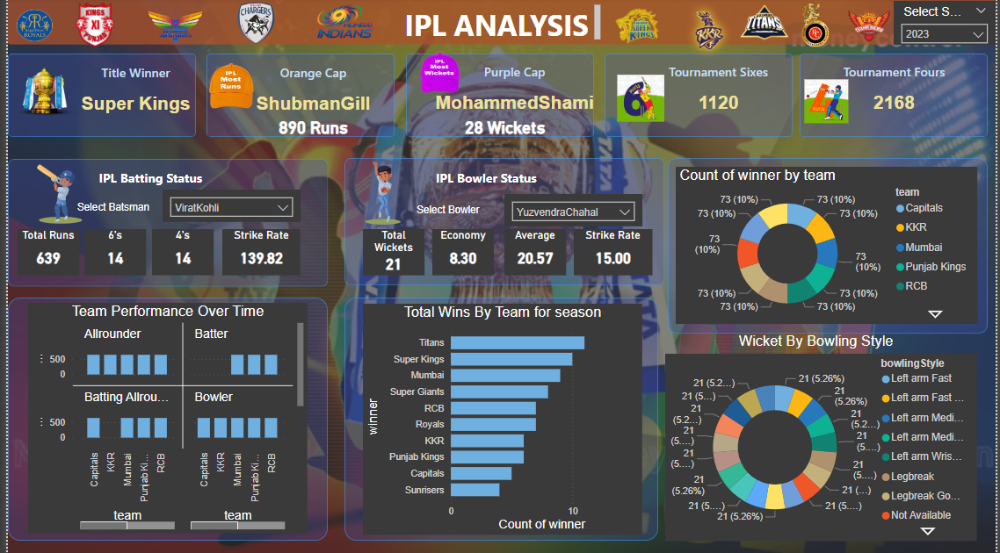

# IPL Data Analysis

## Project Overview
This Power BI project focuses on analyzing IPL (Indian Premier League) cricket data to gain valuable insights into team and player performance, match outcomes, and key metrics related to both batting and bowling. By leveraging data from multiple related tables, this analysis provides a comprehensive view of the tournament's dynamics.

## Objectives
- **Analyze team performance** across multiple seasons.
- **Evaluate individual player performance** in both batting and bowling.
- **Identify key metrics** that influence match outcomes.
- **Visualize trends and patterns** within the data to support data-driven decision-making.

## Data Sources

### 1. Fact Bowling
This table provides detailed information on bowling performance across matches.

| Column      | Description                                    |
|-------------|------------------------------------------------|
| match_id    | Unique identifier for the match.               |
| match       | Description or name of the match.              |
| bowlingTeam | Name of the team that is bowling.              |
| bowlerName  | Name of the bowler.                            |
| overs       | Number of overs bowled by the bowler.          |
| maiden      | Number of maiden overs bowled.                 |
| runs        | Runs conceded by the bowler.                   |
| wickets     | Wickets taken by the bowler.                   |
| economy     | Economy rate of the bowler.                    |
| 0s          | Number of dot balls bowled.                    |
| 4s          | Number of fours conceded.                     |
| 6s          | Number of sixes conceded.                     |
| wides       | Number of wide balls bowled.                   |
| noBalls     | Number of no balls bowled.                     |

### 2. Fact Batting Summary
This table captures batting performance details.

| Column      | Description                                      |
|-------------|--------------------------------------------------|
| match_id    | Unique identifier for the match.                 |
| match       | Description or name of the match.                |
| teamInnings | The team batting in the innings.                 |
| battingPos  | Batting position of the player.                  |
| batsmanName | Name of the batsman.                            |
| out/not_out | Whether the batsman was out or not out.         |
| runs        | Runs scored by the batsman.                      |
| balls       | Balls faced by the batsman.                      |
| 4s          | Number of fours hit.                            |
| 6s          | Number of sixes hit.                            |
| SR          | Strike rate of the batsman.                      |

### 3. Dim Player
This table contains player-related information.

| Column         | Description                                    |
|----------------|------------------------------------------------|
| name           | Name of the player.                           |
| team           | Team the player belongs to.                   |
| battingStyle   | Batting style of the player (e.g., Right-hand bat). |
| bowlingStyle   | Bowling style of the player (e.g., Right-arm fast). |
| playingRole    | Role of the player (e.g., Batsman, Bowler).   |

### 4. Dim Match Summary
This table summarizes match details.

| Column      | Description                                    |
|-------------|------------------------------------------------|
| team1       | Name of the first team.                       |
| team2       | Name of the second team.                      |
| winner      | Winner of the match.                          |
| margin      | Margin of victory.                            |
| matchDate   | Date of the match.                            |
| match_id    | Unique identifier for the match.              |

## Project Features
- **Data Cleaning & Transformation:** Preprocessing of raw IPL data to create a clean and structured dataset suitable for analysis.
- **Interactive Dashboards:** Power BI dashboards that allow users to explore various aspects of IPL data through interactive visualizations.
- **Key Insights:** Identification of top-performing teams and players, along with patterns and trends that impact match outcomes.

## Tools & Technologies
- **Power BI:** For data visualization and dashboard creation.
- **SQL:** For querying and managing the data.
- **Excel:** For initial data cleaning and exploration.

## Conclusion
This project provides deep insights into the IPL, enabling fans, analysts, and stakeholders to understand the factors that contribute to success in the league. The interactive dashboards and visualizations make it easy to explore different dimensions of the data, helping to uncover valuable trends and insights.

